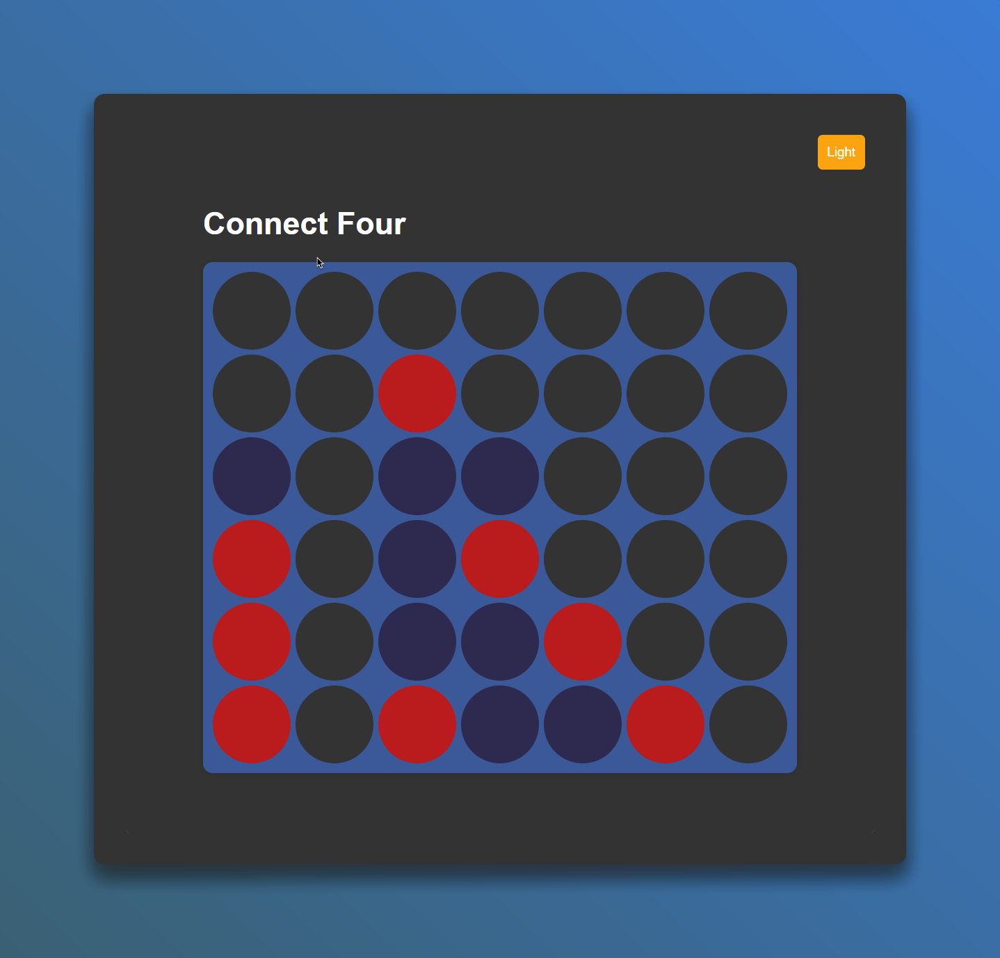

# Connect Four 🎮



[](https://github.com/EXELVI/Connect_Four/stargazers)
[](https://github.com/EXELVI/Connect_Four)
[](https://github.com/EXELVI/Connect_Four/issues)
[](https://github.com/EXELVI/Connect_Four/commits/main)

[](https://developer.mozilla.org/en-US/docs/Web/JavaScript)
[](https://developer.mozilla.org/en-US/docs/Web/HTML)
[](https://developer.mozilla.org/en-US/docs/Web/CSS)

Welcome to **Connect Four**! This is a simple implementation of the classic Connect Four game, built using HTML, CSS, and JavaScript. Challenge an AI and see who can connect four first!

## Features ✨

- **AI Opponent**: Challenge yourself against a computer player.
- **Dark Mode**: Toggle between light and dark themes.

## Demo 🚀

You can try the game directly [here](https://exelvi.github.io/Connect_Four).

## Installation 🛠️

To run this project locally, follow these steps:
 
1. **Clone the repository:**
    ```bash
    git clone https://github.com/EXELVI/Connect_Four.git
    ```
2. **Navigate to the project directory:**
    ```bash
    cd Connect_Four
    ```
3. **Open `index.html` in your browser:**
    - Simply double-click the `index.html` file, or
    - Use a local server like [Live Server](https://marketplace.visualstudio.com/items?itemName=ritwickdey.LiveServer) in VS Code.

## How to Play 🕹️

1. **Start the game:** The game board will appear when you open the `index.html` file.
2. **Select a column:** Click on any of the seven columns to drop your disc.
3. **Alternate turns:** The game alternates between Player 1 (red) and AI (blue).
4. **Winning condition:** The first player to connect four discs vertically, horizontally, or diagonally wins!

## Dark Mode 🌙

You can toggle between light and dark mode by clicking the button at the top right corner. The theme preference is saved in `localStorage`, so your choice persists even after refreshing the page.

## Contributing 🤝

Feel free to fork this repository and contribute via pull requests. All contributions are welcome!